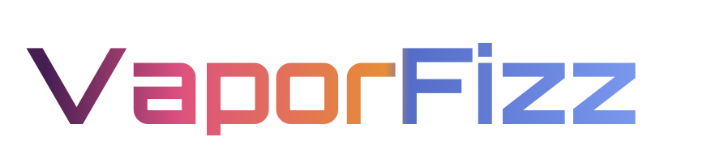

# VaporFizz Website

_This repo contains the infrastructure and source code for the [VaporFizz](#-what-is-vaporfizz) website._

The public facing website of VaporFizz is a static website that is, for now, just barely representing the proud VaporFizz brand on the Internet. As more and more services and products are provided by VaporFizz, the will grow as well.

   

## 🤷‍♀️ Requirements

The basic requirements for the VaporFizz website is:

1. Establish a online presence that proudly presents the VaporFizz brand online in the form of a simple website (so our competitors can see we are alive and still paying the yearly domain fee).
2. Website must be globally reachable for consumers and partners with a minimum of latency.

## 🤦‍♀️ Architecture

## 🙋‍♀️ Deployment

## 🥤 What is VaporFizz?

VaporFizz is a imaginary soft drinks company on their way to success by leveraging the power of the cloud (specifically Microsoft Azure).

By tackling the many challenges in supporting a soft drinks company, all the way from the factory floor, to distribution, sale, support, marketing, internal functions and the occasionally legacy nightmare of Ruth from management that refuses to switch from ICQ 99b to Microsoft Teams, we will look at how the services offered by Microsoft Azure can help us from a technical point of view, by slapping down some code and diagrams in nice pastel colors.

VaporFizz is created by [benne](https://github.com/benne).

## 🔓 License

The MIT License (MIT)

Copyright (c) 2022 Benne

Permission is hereby granted, free of charge, to any person obtaining a copy
of this software and associated documentation files (the "Software"), to deal
in the Software without restriction, including without limitation the rights
to use, copy, modify, merge, publish, distribute, sublicense, and/or sell
copies of the Software, and to permit persons to whom the Software is
furnished to do so, subject to the following conditions:

The above copyright notice and this permission notice shall be included in all
copies or substantial portions of the Software.

THE SOFTWARE IS PROVIDED "AS IS", WITHOUT WARRANTY OF ANY KIND, EXPRESS OR
IMPLIED, INCLUDING BUT NOT LIMITED TO THE WARRANTIES OF MERCHANTABILITY,
FITNESS FOR A PARTICULAR PURPOSE AND NONINFRINGEMENT. IN NO EVENT SHALL THE
AUTHORS OR COPYRIGHT HOLDERS BE LIABLE FOR ANY CLAIM, DAMAGES OR OTHER
LIABILITY, WHETHER IN AN ACTION OF CONTRACT, TORT OR OTHERWISE, ARISING FROM,
OUT OF OR IN CONNECTION WITH THE SOFTWARE OR THE USE OR OTHER DEALINGS IN THE
SOFTWARE.
